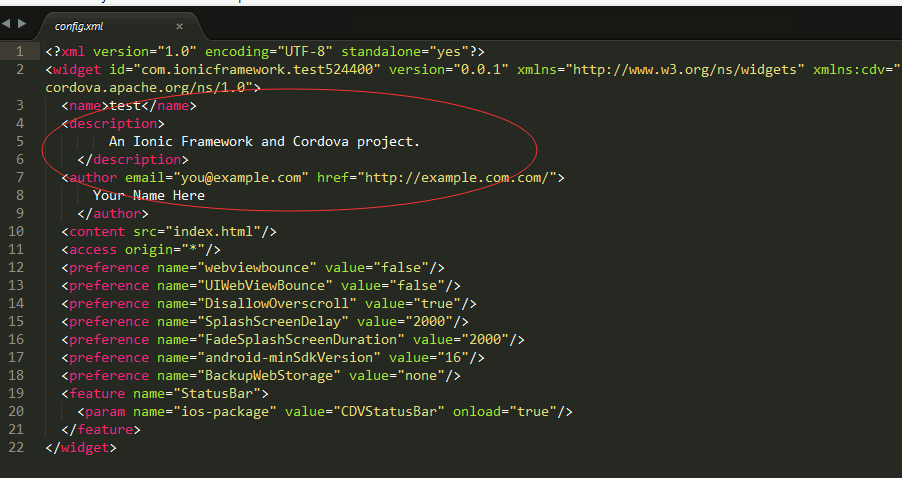
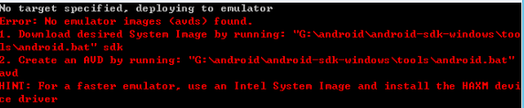

# hybrid-app
use angular and cordova achieve hybrid app
项目思路，使用angular，ionic，cordova创建一个app  

##  一：环境配置      

1. 会使用到的工具：nodejs ionic cordova angular
2. 安装nodejs，官网下载，傻瓜式安装  https://nodejs.org/en/
3. 查看nodejs是否安装成功，cmd模式下，输入命令：
`nodejs -v`，显示对应版本号即安装成功
4. 安装ionic，cmd模式下输入命令：`npm install -g cordova;npm install -g ionic;`
使用npm模式直接访问外网，遇到网络不好的情况需要翻墙，如果有淘宝镜像，可以将npm改为cnpm；
5. 同样通过查看版本号确认是否安装成功，ionic -v; cordova -v;    
6. java jdk/jre还有android sdk（adb）环境变量根据自己电脑百度相应安装方法     

##  二：创建项目
1. 创建APP
	ionic start myApp tabs //创建带有top栏和bottom栏的实例项目，myApp为项目名（可自行定义）	
	ionic start myApp sidemenu //创建带左侧带menu栏的实例项目    
	ionic start myApp blank //创建空白项目    
2. 配置文件中，根目录下config.xml文件中，android的name可以更改并且可以写中文，ios不要使用中文

3. 创建项目后添加平台 ionic platform add android(ios);
4. build, ionic bulid android(ios)
5. run,ionic run android(ios);手机和电脑连接，
如果出现一下错误，打开电脑的设备管理器，查看手机的驱动是否正常，如果出现感叹号直接修复即可

    
6. 通过weinre实现实时debug	
      安装，同样通过cmd命令；npm -g install weinre;
      启动，weinre -boundHost IPAddress(本机ip)
      将weinre管理界面中的target script 代码直接进行复制，并粘贴到index.html文件中	
7. 实时刷新。ionic run android -l -c;

##  三：数据处理
1. 数据来源，聚合数据免费接口
2. 通过新浪云访问聚合数据，并将数据转化为json的格式
3. 通过angular的承诺机制，成功渲染数据